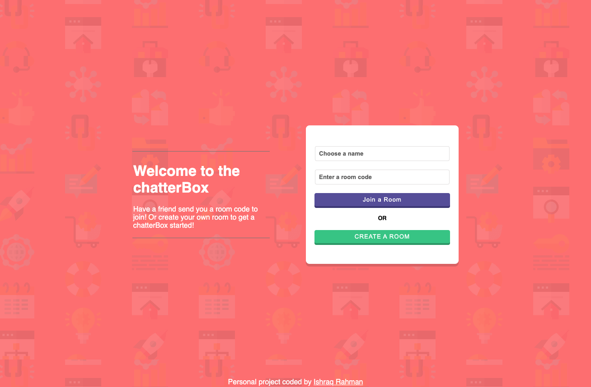
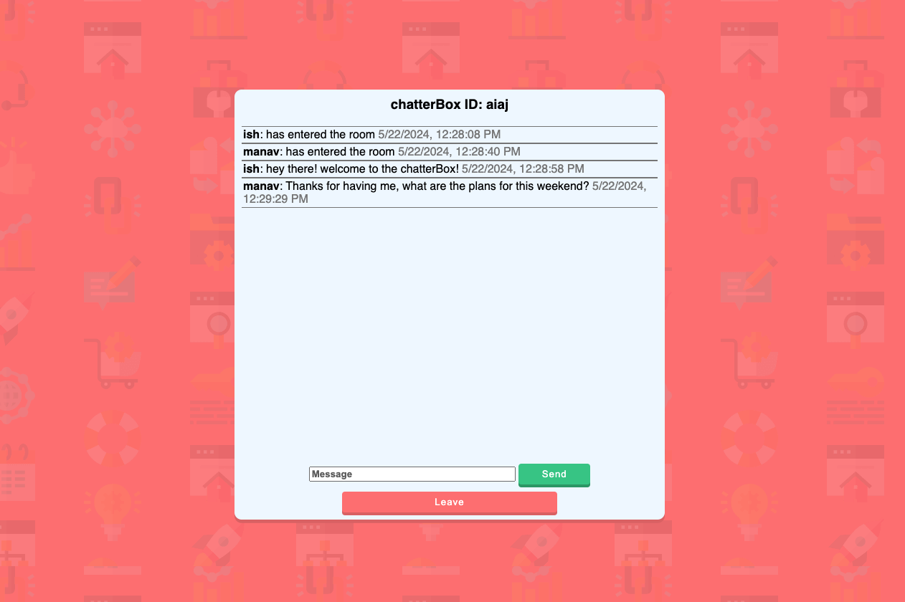

Personal Project: chatterBox Web Application
===========================
# ChatterBox

ChatterBox is a web application designed for real-time chat functionality, enabling multiple users to join, communicate, and leave chatrooms simultaneously. It leverages Python to dynamically generate HTML templates and uses Flask and Flask-SocketIO for seamless real-time interactions.

## Key Features

- **Dynamic HTML Template Generation**
  - **Python-generated HTML templates** for a responsive user interface.
  
- **Real-Time Communication**
  - **Instant message broadcasting and reception** using Flask and Flask-SocketIO.

- **Multi-User Chatrooms**
  - Supports **multiple users joining and leaving chatrooms** without disrupting ongoing conversations.

- **Interactive User Interface**
  - **Engaging and user-friendly design** with real-time updates for messages and user presence.

## Screenshots




## Technical Highlights

- **Flask Framework**
  - Simplifies backend development and request handling.

- **Flask-SocketIO Integration**
  - Manages WebSocket connections for real-time bi-directional communication.

- **User Experience (UX)**
  - Provides a smooth, lag-free chat experience with simple navigation.

## Technology Stack

- **Backend:** Python, Flask, Flask-SocketIO
- **Frontend:** HTML, CSS, JavaScript

## Future Enhancements

- **Advanced Features:**
  - Support for additional media types (images, videos) within chatrooms.
  - User authentication and personalized chat history.

- **Enhanced UI/UX:**
  - Further refinement of the user interface for better usability.
  - Addition of themes and customization options for users.

## View my project!

1. **Clone the repository:**
    ```sh
    git clone git@github.com:1shman/chatterBox.git
    ```

2. **Navigate to the project directory:**

3. **Install the required dependencies:**
    ```sh
    brew install python3
    pip install -r requirements.txt
    python3 -m venv env
    source env/bin/activate
    ```

4. **Run the application:**
    ```sh
    python main.py
    ```

5. **Open your browser and visit (use a incognito tab if opening the web application a second time):**
    ```sh
    http://127.0.0.1:5000
    ```

Enjoy chatting with ChatterBox! For any questions or feedback, feel free to open an issue or contact me at <ishman@umich.edu>

